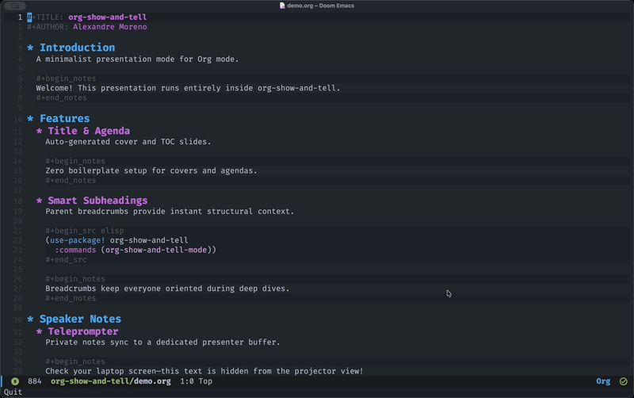

#+TITLE: org-show-and-tell
#+AUTHOR: Alexandre Moreno

An opinionated Org mode presentation package featuring an integrated
teleprompter.

* What it does

- Uses buffer narrowing to isolate each slide.
- Genereates a title cover from =#+TITLE:= / =#+AUTHOR:= headers
  and an agenda slide from your document headings.
- Displays slide progress in the mode-line.
- Displays parent-heading breadcrumbs on sub-slides for context.
- Syncs private notes from =#+begin_notes= blocks to a dedicated presenter
  buffer ([[*Speaker Notes][see below]]).
- Centers slides with custom margins, hides heading asterisks (=*=), block tags
  (=#+begin_src=), line numbers, cursors, =hl-line-mode=, and fringes.
- Temporarily applies a presentation theme and restores your exact buffer state
  on exit.
- Maps =h= / =j= / =k= / =l= and =q= to slide navigation.

* Doom Emacs Setup

Add to ~packages.el~:

#+begin_src elisp
(package! org-show-and-tell :recipe (:host github :repo
  "moleike/org-show-and-tell"))
#+end_src

* Configuration

#+begin_src elisp
(use-package! org-show-and-tell
  :commands (org-show-and-tell-mode)
  :custom
  ;; Automatically insert a title cover slide
  (org-show-and-tell-title-slide t)
  
  ;; Automatically insert an agenda slide
  (org-show-and-tell-agenda-slide t)
  
  ;; How much to scale the text during presentation
  (org-show-and-tell-text-scale 2)
  
  ;; Left and right window margin padding
  (org-show-and-tell-margin-width 20)
  
  ;; Theme to apply in 'show-and-tell' mode (e.g., 'leuven). Nil means keep current theme.
  (org-show-and-tell-theme nil)

  :init
  (map! :leader
        :desc "Toggle Presentation" "t P" #'org-show-and-tell-mode))
#+end_src

* Speaker Notes

1. Add notes to your slides:
   
   #+begin_src org
   ,#+TITLE: Presentation Title
   ,#+AUTHOR: Alexandre Moreno
   
   ,* Main Topic
   ,** Sub-topic Title Slide content goes here.
   
   ,#+begin_notes
   Speaker notes for this slide.
   ,#+end_notes
   #+end_src

2. Start the presentation by toggling ~M-x doom-tree-slide-mode~

3. Clone your frame (e.g. ~M-x clone-frame~) and either drag it to your external
   display or select it as your shared window in your meeting app.

4. Launch presenter mode on your laptop frame by running ~M-x
   org-show-and-tell-presenter-notes~. This opens a =*Presenter Notes*= split
   that updates automatically as you navigate.
